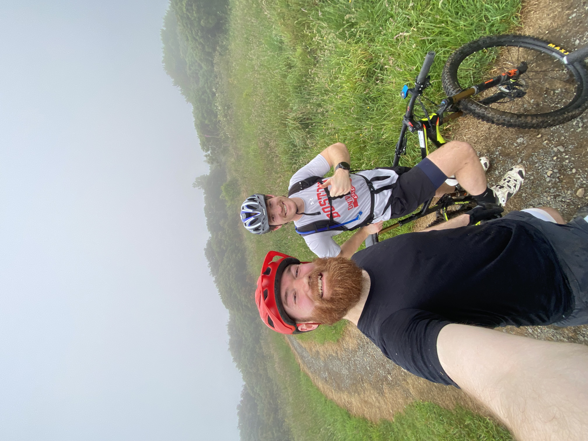
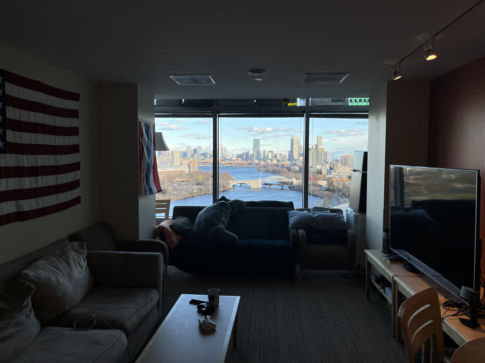

{.lightbox group="gallery"}

{.lightbox group="gallery"}

{.lightbox group="gallery"}

{.lightbox group="gallery"}

{.lightbox group="gallery"}

{.lightbox group="gallery"}

{.lightbox group="gallery"}

{.lightbox group="gallery"}

{.lightbox group="gallery"}

{.lightbox group="gallery"}

{.lightbox group="gallery"}

{.lightbox group="gallery"}

{.lightbox group="gallery"}

{.lightbox group="gallery"}

{.lightbox group="gallery"}

{.lightbox group="gallery"}

{.lightbox group="gallery"}

{.lightbox group="gallery"}

.jpeg){.lightbox group="gallery"}

