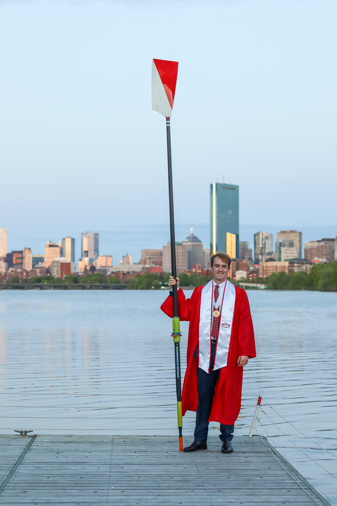
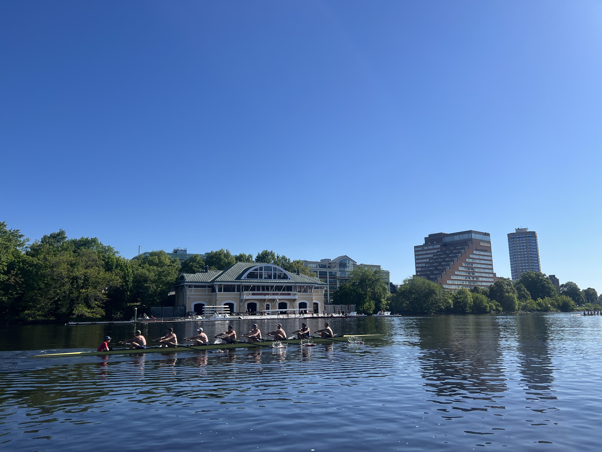

  <h1>Bowen de Gouw's Website</h1>
  

# Kia Ora, Thank you for visting my website!

Kia ora and welcome! I’m Bowen — a lifelong learner, student-athlete, and data-driven problem solver. I was born in the Netherlands, raised in New Zealand, and for now call Boston home. My journey across continents has shaped how I think, lead, and connect with others.

Growing up on Auckland's North Shore, I learned to balance curiosity and discipline — two traits that came from equal parts academics and athletics. At Westlake Boys High School, one of New Zealand’s top-performing schools, I discovered my passion for both numbers and teamwork.

In my final year of high school, I earned an athletic scholarship to Boston University, joining the Men’s Rowing Team. At 18, I packed my bags and crossed the world, driven by the goal of earning a world-class education and competing at the highest collegiate level.

Four years later — countless early mornings, races, and study sessions later — I graduated from the Questrom School of Business with a BSBA and a deep appreciation for resilience, leadership, and collaboration.

After graduation, I wanted to sharpen my technical toolkit and bridge the gap between business insight and data analytics. That led me to pursue a Master of Science in Applied Business Analytics (MET, Boston University) — a program designed to explore predictive modeling, data mining, cloud platforms, and machine learning.

My goal is to use these tools to make data more human — helping organizations uncover insights that improve performance, experience, and impact.

---

# Get to know me!

1. I am a huge sports fan and since moving to the US my passion for live sports events has flourished. I've been fortunate to watch MLB, NBA, NFL, NHL and CFB games live. 

  <h2 style="color:#000000;">🏆 My Favorite Teams</h2>

  
<strong>Rugby:</strong> All Blacks

  
<strong>Super Rugby:</strong> Auckland Blues 💙

  
<strong>NFL:</strong> New England Patriots 🏈

  
<strong>NHL:</strong> Boston Bruins 🏒

  
<strong>NBA:</strong> Boston Celtics 🏀

  
<strong>MLB:</strong> Boston Red Sox ⚾️

---

2. I am one of 5 B's in my family. If you spot the number plate '5BEEZ' rolling around Auckland's North Shore, you've likely caught one of the B's. We were lucky enough to reunite last May for my Graduation, see the picture below from DeWolfe Boathouse with Boston's Skyline in the background.

:::{.quarto-figure-center}
{width=400px}
:::

---

3. INSERT ANOTHER FUN PIECE OF INFORMATION ABOUT MYSELF 

--- 

4. XYZ

---

5.

---

# Photo Gallery

:::{.quarto-figure-center}
{width=400px}
:::

---

:::{.quarto-figure-center}
{width=400px}
:::

---

  <strong>
    <a href="https://www.linkedin.com/in/bowen-de-gouw" target="_blank">LinkedIn</a> ·
    <a href="https://github.com/bdegouw" target="_blank">GitHub</a> ·
    <a href="mailto:bdegouw@bu.edu">Email</a>
  </strong>

---