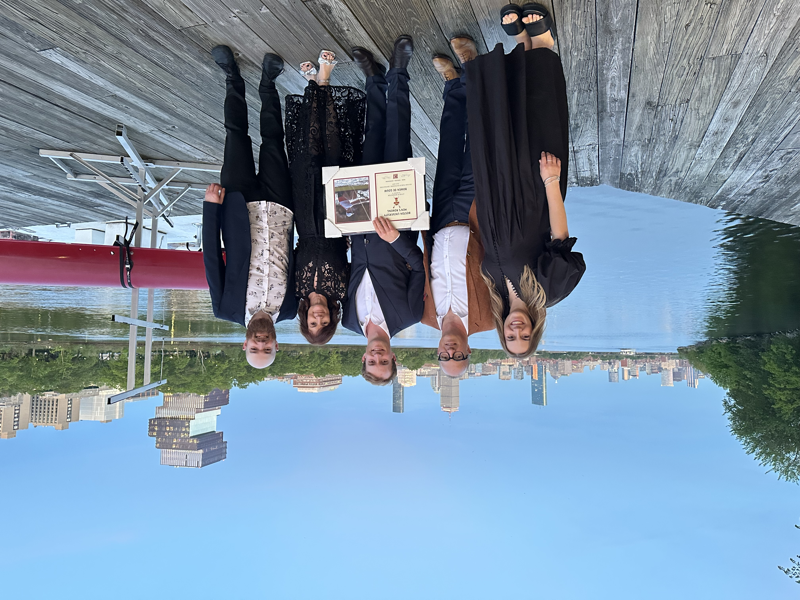

  <h1>Bowen de Gouw's Website</h1>
  

# Kia Ora, Thank you for visting my website!

Kia ora and welcome! I’m Bowen de Gouw - a Netherlands born, New Zealand Raised, and US educated graduate student. I am currently pursuing a Master of Science in Business Analytics at Boston Universities Metropolitan College. I will be graduating in May 2026, before emparking on some solo travel to Europe. Following my travels, I will be moving to Sydney, Australia to begin my career in Tech Consulting at EY as part of their focusing on AI & Data team.

My journey to the US started in the fall of 2021 as a result of being recruited as a student-athlete on the Boston Universities Men's Rowing Team. I completed 4 years on the team during my undergraduate studies, competing in 4 IRA national championships. I was fortunate to serve on the teams leadership council for 3 years and was the team captain in my senior year. My time on the team taught me many valuable lessons about teamwork, leadership and resilience. In May 2025, my time in high-perfomance rowing came to an end as I graduated with a Bachelor of Science in Business Administration with a concentration in Business Analytics. 

Prior to my time in the US, I lived on Auckland's North Shore and attended Westlake Boys High School. My experience at Westlake Boys was incredibly formative, and I am grateful to have attended such a prestigious school with a strong focus on academics, sports and extracurricular activities. I was fortunate to have many hands-on leadership opportunities during my time at Westlake, including being the Head Boy and Rowing Captain in my final year. 

The aim of this website is to share a bit about myself, my interests, my academic and professional journey. I am passionate about data, technology, and the impact they can have on businesses and society. The use of this website will evolve and change over time, mainly as I learn new skills and ways to leverage the tools available to me. I look forward to sharing it with you!

---

# Get to know me!

---

I am one of 5 B's in my family. If you spot the number plate '5BEEZ' rolling around Auckland's North Shore, you've likely caught one of the B's. We were lucky enough to reunite last May for my Graduation, see the picture below from DeWolfe Boathouse with Boston's Skyline in the background.

:::{.quarto-figure-center}
{width=400px}
:::

---

I am a huge sports fan and since moving to the US my passion for live sports events has flourished. I've been fortunate to watch MLB, NBA, NFL, NHL and CFB games live. On the top of my live sports bucket list is to watch a premier league soccer game in the UK, attend a boxing day test match at the MCG in Melbourne, and a baseball game in Japan.

  <h2 style="color:#000000;">🏆 My Favorite Teams</h2>

  
<strong>Rugby:</strong> All Blacks ⚫🏉

  
<strong>Super Rugby:</strong> Auckland Blues 💙🏉

  
<strong>NFL:</strong> New England Patriots 🏈🔴🔵⚪

  
<strong>NHL:</strong> Boston Bruins 🏒🐻

  
<strong>NBA:</strong> Boston Celtics ☘️🏀

  
<strong>MLB:</strong> Boston Red Sox 🅱️⚾️

---

  <strong>
    <a href="https://www.linkedin.com/in/bowen-de-gouw" target="_blank">LinkedIn</a> ·
    <a href="https://github.com/bdegouw" target="_blank">GitHub</a> ·
    <a href="mailto:bdegouw@bu.edu">Email</a>
  </strong>

